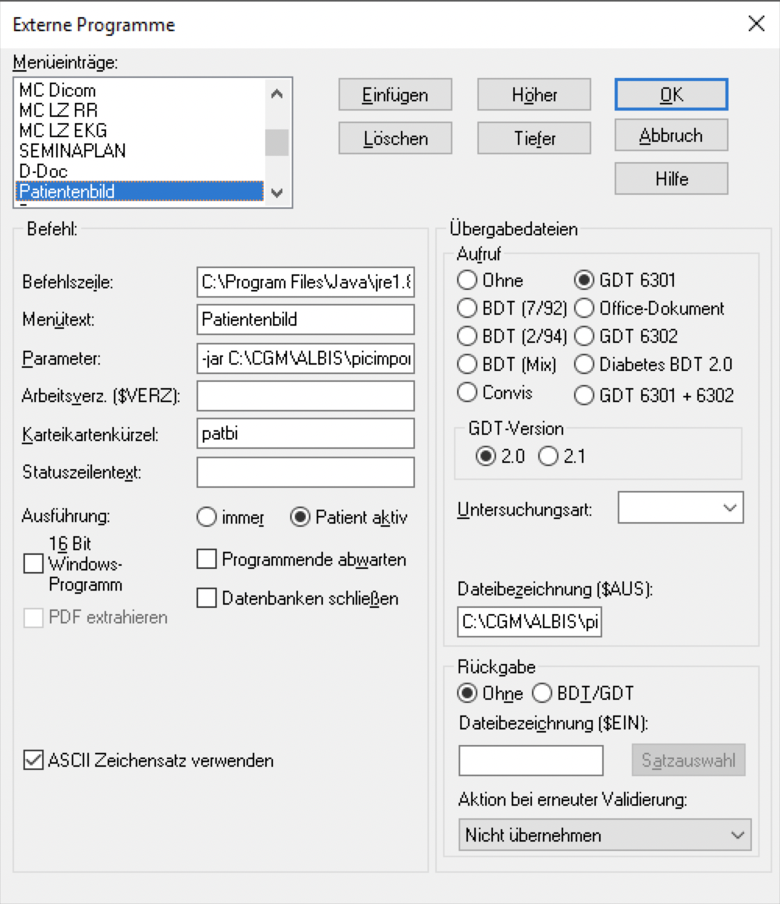
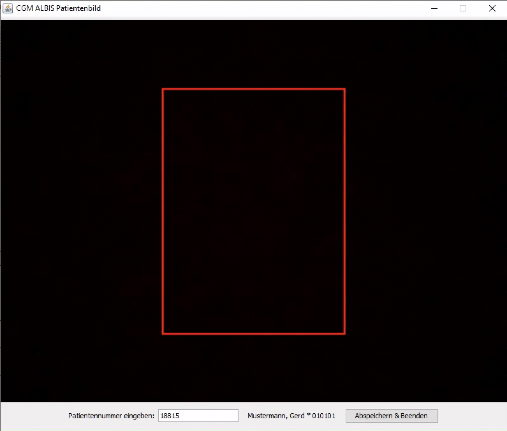

# CGM ALBIS Patientenbild

[](https://travis-ci.org/mkk-kamen/cgm-albis-patientenbild)
[](https://coveralls.io/r/mkk-kamen/cgm-albis-patientenbild?branch=master)

Java program for capturing picture in portrait mode of customers with typical webcam for use in CGM ALBIS.
It saves the image to ALBIS database folder on network share.

The latest stable version is: **```1.0.0```**

## Usage



Create external program in CGM ALBIS with a GDT file with name picimport.gdt below **```C:\CGM\ALBIS\picimport```**. 



Start program by call it from external program menu. 

## Dependencies

 - [webcam-capture] This library allows you to use your build-in or external webcam directly from Java.
 - [image4j] The image4j library allows you to read and write certain image formats in 100% pure Java.
 - [thumbnailator] A thumbnail generation library for Java


## Maven

The latest stable version is [available](http://search.maven.org/#artifactdetails|com.github.mkk-kamen|cgm-albis-patientenbild|1.0.0|bundle) in Maven Central:

```xml
<dependency>
  <groupId>com.github.mkk-kamen</groupId>
  <artifactId>cgm-albis-patientenbild</artifactId>
  <version>1.0.0</version>
</dependency>
```


## License

MIT

[webcam-capture]: <https://github.com/sarxos/webcam-capture>
[image4j]: <http://image4j.sourceforge.net>
[thumbnailator]: <https://github.com/coobird/thumbnailator>
